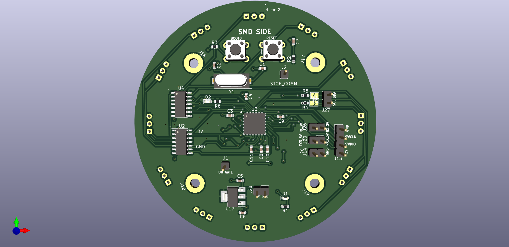
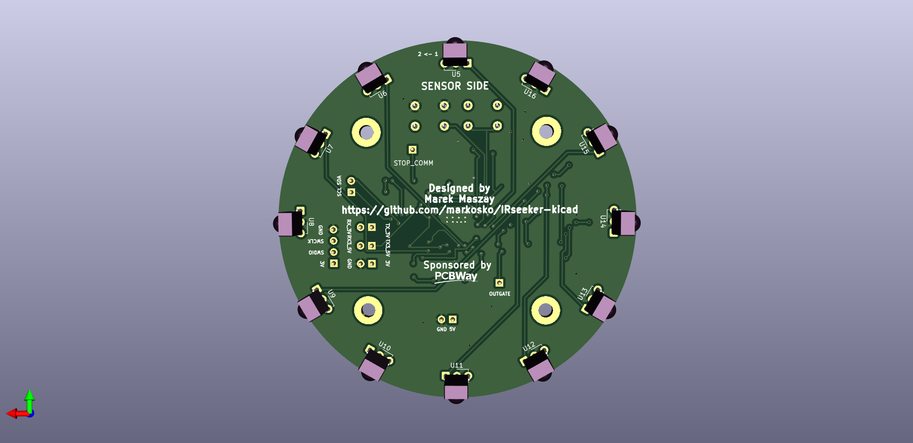

View this project on [CADLAB.io](https://cadlab.io/project/27377).

# IRseeker-kicad

Used as replacement for IRseeker sensor and similar for Lightweight / Entry leagues with infra ball in Robocup Junior, based on STM32G431CBU6 and TSSP4038

With communication over I2C or Serial protocol.

Serial over **TX_3V** / **RX_3V** pins is **only 3.3V tolerant**!

Serial over **TX3_5V** / **RX3_5V** pins is **5V tolerant**.

**I2C** is 5V tolerant.

Logic **AND** gates **HEF4082BT** at **U2** and **U4** are optional for chip at PC6 pin input to detect if any TSSP4038 detects ball.

**AMS1117** part is not needed in case of powering from 3.3V source

Programmed by external STLINK or similar over SWD pins at J13 header.

